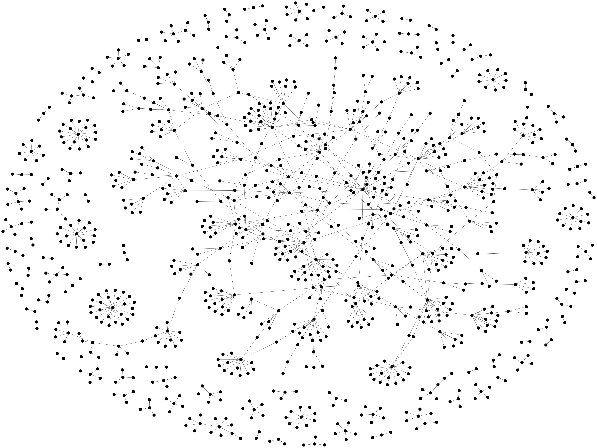
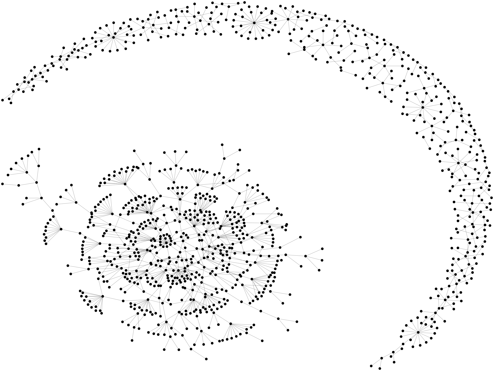

# Graph Representation

&nbsp;&nbsp;&nbsp;&nbsp;&nbsp;&nbsp;This pages demonstrates the various graphing options available using iGraph for the representation of the data. 

## Description
Depicted below is are the 4 graphing options available for the representation of the same data using 1049 nodes and 1000 connections.

### Graphing Options

	
	

 

	
	

### Sources:
I used the official igraph website for assitiance in creating these models: 
* (https://igraph.org/python/doc/tutorial/tutorial.html)
* (https://en.wikipedia.org/wiki/Force-directed_graph_drawing)
* (https://github.com/igraph/python-igraph/)